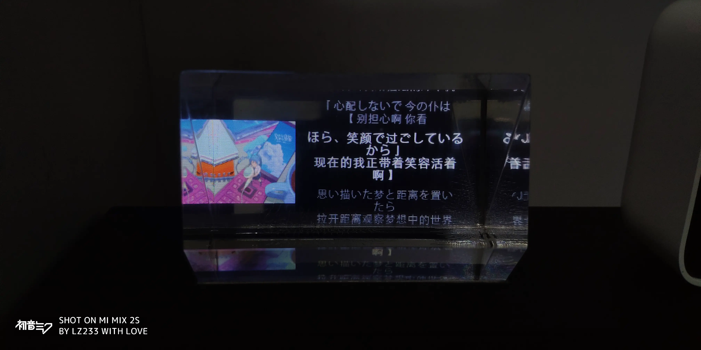

> 编写这篇文章时 ExoPlayer 的版本是 r2.14.2，其操作方法及其行为可能已随时间推移而发生变更。

---



最近在为 [Meizu Gravity](/2020/06/06/meizu-gravity-evaluation) 写一个[第三方网易云客户端](https://github.com/lz233/MeizuGravity/blob/master/NETEASECLOUDMUSIC.md)，有用到 ExoPlayer，也有编译 Flac 扩展的需求。这里记录一下最简单的编译过程。

- 选择合适的位置，clone ExoPlayer 项目。

  ```bash
  git clone https://github.com/google/ExoPlayer.git
  ```

- 转到项目根目录，定义以下变量。

  ```bash
  cd "/Users/lz233/Documents/GitHub/ExoPlayer"
  EXOPLAYER_ROOT="$(pwd)"
  FLAC_EXT_PATH="${EXOPLAYER_ROOT}/extensions/flac/src/main"
  ```

- 定义 Android NDK 所在的位置。这里我们使用 NDK r21，暂时没有测试 r22。

  ```bash
  NDK_PATH="/Users/lz233/Library/Android/sdk/ndk/21.1.6352462"
  ```

- 运行以下指令，获取 `flac-1.3.2`。

  ```bash
  cd "${FLAC_EXT_PATH}/jni" && \
  curl https://ftp.osuosl.org/pub/xiph/releases/flac/flac-1.3.2.tar.xz | tar xJ && \
  mv flac-1.3.2 flac
  ```

- 运行以下指令，进行编译。

  ```bash
  cd "${FLAC_EXT_PATH}"/jni && \
  ${NDK_PATH}/ndk-build APP_ABI=all -j4
  ```

- 转到 `${FLAC_EXT_PATH}/libs`，能看见编译好的文件，拖到项目的 `libs` 目录。

  ```bash
  ├── build.gradle
  ├── libs
  │   ├── armeabi-v7a
  │   │   └── libflacJNI.so
  │   └── x86
  │       └── libflacJNI.so
  ├── proguard-rules.pro
  └── ...
  ```

- 将 `${FLAC_EXT_PATH}/java` 中的代码复制到项目中。

  ```bash
  └── src
      ├── androidTest
      │   └── ...
      └── main
          ├── AndroidManifest.xml
          └── java
              └── com
                  └── google
                      └── android
                          └── exoplayer2
                              └── ext
                                  └── flac
                                      ├── FlacBinarySearchSeeker.java
                                      ├── FlacDecoder.java
                                      ├── FlacDecoderException.java
                                      ├── FlacDecoderJni.java
                                      ├── FlacExtractor.java
                                      ├── FlacLibrary.java
                                      ├── LibflacAudioRenderer.java
                                      └── package-info.java
  ```

- 修改 `build.gradle`，并检查有无报错。

  ```groovy
  android{
    ...
    defaultConfig{
      ...
      ndkVersion '22.1.7171670'
    }
    ...
    sourceSets {
      main {
        jniLibs.srcDirs = ['libs']
      }
    }
  }
  ...
  dependencies{
    ...
    api 'com.google.android.exoplayer:exoplayer-core:2.14.2'
    compileOnly 'org.checkerframework:checker-qual:3.16.0'
  }
  ```

一切没有问题的话，ExoPlayer 就会自动使用 Flac 扩展加载 `.flac` 文件了。
