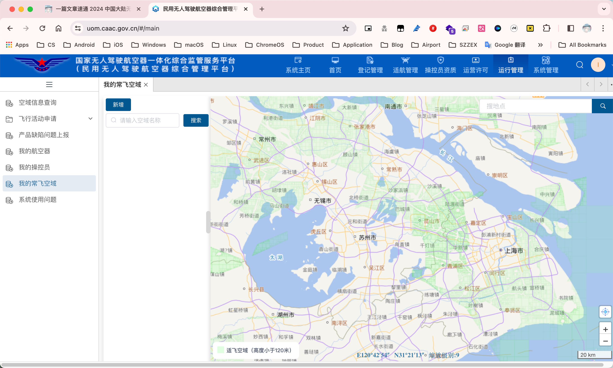
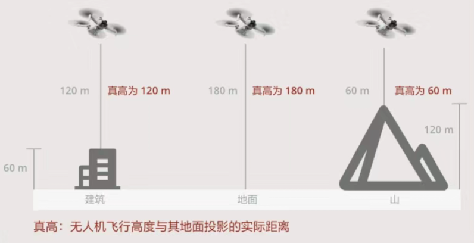

- 本文提到的「无人机新规」为[《无人驾驶航空器飞行管理暂行条例》](https://www.gov.cn/zhengce/content/202306/content_6888799.htm)，**自 2024 年 1 月 1 日起施行**。

- 「无人机」的定义需要满足：没有搭载驾驶员、自备动力系统、**需要有高度保持和位置保持功能**。DJI Avata 作为穿越机，官方对其的界限很模糊，DJI 想让其尽量往「航模」靠。

- 「UOM 平台」指[「民用无人驾驶航空器综合管理平台」](https://uom.caac.gov.cn)，是国家集无人机登记管理、飞行申请、操控资质申请于一体的平台。

- 「管制区域」理论上有：**真高 120m 以上的空域**、重要设施和交通枢纽附近（**电气化铁道**、高速公路、机场……）、大型仓储区域、军事和政治相关区域。实际上请直接参考 UOM 平台，除了绿色的「适飞空域」，**其他全是「管制空域」**。

  

- 「真高」指无人机高度到其地面投影的**实时高度**，这意味着「借高」从理论上来说是**无效**的。
  举个例子：楼高为 60m，无人机在上方升高 120m，真高为 120m，但是一旦离开楼顶范围，真高为 180m，已经进入了「管制空域」。

  

- 无人机的分类：

  | 类型 |                             特征                             |
  | :--: | :----------------------------------------------------------: |
  | 微型 | 空机重量＜0.25kg、最大真高≤50m、最大速度≤40km/h、无线电功率符合 |
  | 轻型 | 空机重量≤4kg、起飞重量≤7kg、最大速度≤100km/h、可靠被监视能力 |
  | 小型 |         空机重量≤15kg、起飞重量≤25kg、可靠被监视能力         |
  | 中型 |                        起飞重量≤150kg                        |
  | 大型 |                       起飞重量＞150kg                        |
  | 农用 | 最大真高≤30m、最大速度≤50km/h、最大半径≤2km、可靠被监视能力  |

  - DJI Mini 系列无人机虽然重量＜0.25kg，但因无线电发射设备超出微功率短距离、最大飞行真高、最大平飞速度均超出要求，因此也为「轻型无人机」。
  - DJI 目前在售的所有**个人消费级产品**均属于「轻型无人机」，因此接下来我们只关注「轻型无人机」。

- 所有无人机均需要进行实名登记。

- 操控「轻型无人机」**无需**任何驾驶执照，但在「管制区域」内飞行需要申请「理论培训合格证」，申请地点如下图。

  

- 操控「轻型无人机」进行非经营活动**不需要**投保责任险，而经营活动则需要。

- 「融合飞行」是指无人机与有人驾驶航空器**同时**在**同一空域**内飞行。在「融合飞行」的情况下，真高最高应不超过 **300m**。

---

综上，当你持有**轻型无人机**想要在 UOM 平台**绿色范围以内**，且**真高低于 120m**的空域飞行，无需进行报备，但需要进行**实名登记**。

**绿色范围以外**或绿色范围以内，但**真高超过 120m** 的地方飞行，均需要提前进行报备，最晚报备时间为**飞行前一日中午 12 点前**，最晚审批时间为当日 21 点前。除此之外，你还需要持有**理论培训合格证**。

在目前阶段，对于个人娱乐，请**不要**在飞行活动申请中勾选涉及特殊活动，且最大飞行高度**最好不要超过 300m**，否则可能会导致申请不通过。