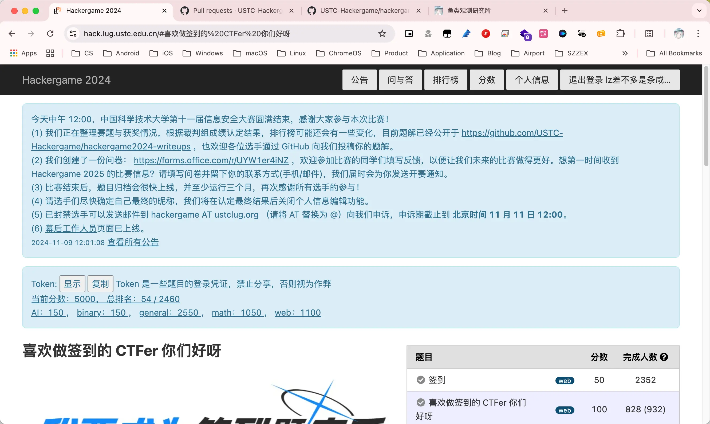
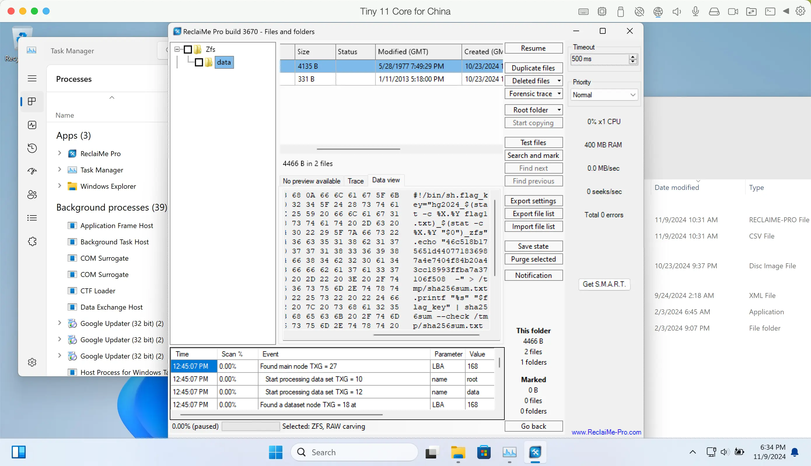
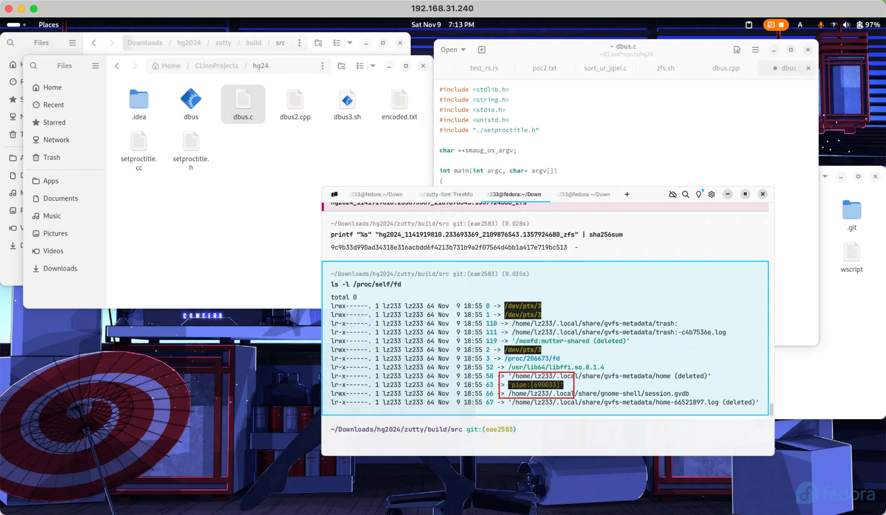

今年是第二次参加 Hackergame 了！竟然会发现大学课程里学的知识似乎突然变的有价值了起来，起码有两题分别涉及到了上学期和这学期的课程！虽然没学过的话，查资料现学现卖也能做，但是这种按着确定方向走就能得到答案的感觉真的很令人安心~

按照惯例，与[官方 Writeup](https://github.com/USTC-Hackergame/hackergame2024-writeups) 解法重合的部分在本篇也不提及，主要看看偷懒的解法和一些碎碎念（背景补充）。题目顺序按官方顺序呈现。

## [喜欢做签到的 CTFer 你们好呀](https://github.com/USTC-Hackergame/hackergame2024-writeups/tree/master/official/%E5%96%9C%E6%AC%A2%E5%81%9A%E7%AD%BE%E5%88%B0%E7%9A%84%20CTFer%20%E4%BD%A0%E4%BB%AC%E5%A5%BD%E5%91%80)
 
> 
> 
> 喜欢做签到的 CTFer 你们好呀，我是一道更**典型**的 checkin：有两个 flag 就藏在中国科学技术大学校内 CTF 战队的招新主页里！

~~在[主页](https://www.nebuu.la)尝试 sudo 命令，可以获得系统管理员权限。~~

## [强大的正则表达式](https://github.com/USTC-Hackergame/hackergame2024-writeups/tree/master/official/%E5%BC%BA%E5%A4%A7%E7%9A%84%E6%AD%A3%E5%88%99%E8%A1%A8%E8%BE%BE%E5%BC%8F)

> 从小 Q 开始写代码以来，他在无数的项目、帖子中看到各种神秘的字符串，听人推荐过，这就是传说中万能的正则表达式。本着能摆烂就绝不努力的原则，小 Q 从来没想过了解这门高雅艺术，遇到不懂的正则表达式就通通丢给 LLM 嘛，他这样想到。不过夜深人静的时候，小 Q 也时常在纠结写这么多 `switch-case` 到底是为了什么。
>
> 终于在一个不眠夜，小 Q 一口气看完了正则表达式的教程。哈？原来这么简单？小 Q 并两分钟写完了自测题目，看着教程剩下的目录，「分组」、「贪婪」、「前瞻」，正则表达式也不过如此嘛，他心想，也就做一些邮箱匹配之类的简单任务罢了。
>
>正当他还沉浸在「不过如此」的幻想中，他刷到了那个关于正则表达式的古老而又神秘的传说：
>
>「正则表达式可以用来计算取模和 CRC 校验……」

题目的第一题小题是用正则表达式匹配 16 的倍数。查阅[互联网](https://en.wikipedia.org/wiki/Divisibility_rule#cite_ref-Pascal's-criterion_2-8)可以很容易发现，判断一个数是否是 16 的倍数，只需要判断其最后 4 位即可。然而，注意到我们还可以通过「千位数是偶数时，末三位能被16整除。	千位数是奇数时，末三位加8能被16整除。」的规则来判断，所以也可以通过分别遍历这两种情况得到正则表达式：

```regex
(0|1|2|3|4|5|6|7|8|9)*((0|2|4|6|8)(all possible numbers)|(1|3|5|7|9)(all possible numbers))
```

题目的第二小题使用正则表达式匹配 13 的倍数。在刚才的资料中我们发现无法仅通过一部分数字就判断这个数字是否是 13 的倍数。此时，应该想到，计算机里的正则表达式和数学上的正则表达式是等价的，并且题目中的 `test_string = bin(t)[2:]  # binary` 也提示我们构建一个 [DFA](https://en.wikipedia.org/wiki/Deterministic_finite_automaton) 来解决这个问题。

生成 DFA 的方式在官方题解已经呈现，这里可视化一下。实际上，你能在[这里](https://stackoverflow.com/questions/21897554/design-dfa-accepting-binary-strings-divisible-by-a-number-n)找到一个更通用的解释。


根据这个 DFA 能推广得到一些很有意思的结论，每个 State 的 Transition Function 排起来是连续的，并且构成一个循环，这在其他数字的倍数中也适用：

```
δ(q0, 0) = q0, δ(q0, 1) = q1, δ(q1, 0) = q2, δ(q1, 1) = q3, δ(q2, 0) = q4, δ(q2, 1) = q5, δ(q3, 0) = q6, δ(q3, 1) = q7, δ(q4, 0) = q8, δ(q4, 1) = q9, δ(q5, 0) = q10, δ(q5, 1) = q11, δ(q6, 0) = q12, δ(q6, 1) = q0, δ(q7, 0) = q1, δ(q7, 1) = q2, δ(q8, 0) = q3, δ(q8, 1) = q4, δ(q9, 0) = q5, δ(q9, 1) = q6, δ(q10, 0) = q7, δ(q10, 1) = q8, δ(q11, 0) = q9, δ(q11, 1) = q10, δ(q12, 0) = q11, δ(q12, 1) = q112, δ(q12, 0) = q0
```

## [ZFS 文件恢复](https://github.com/USTC-Hackergame/hackergame2024-writeups/tree/master/official/ZFS%20%E6%96%87%E4%BB%B6%E6%81%A2%E5%A4%8D)

> 你拿到了一份 ZFS 的磁盘镜像，里面据说有某沉迷 ZFS 的出题人**刚刚删除**的 flag。
>
> 「ZFS，我懂的。」这样说着，你尝试挂载了这个镜像（**请注意，以下命令仅供参考，且系统需要安装 ZFS 内核模块**）：
>
> ```shell
> sudo losetup -fP ./zfs.img
> sudo zpool import -d /dev/loop0 hg2024
> d /hg2024
>
> # Hint: 使用以下命令取消挂载：
> # sudo zpool export hg2024
> # sudo losetup -d /dev/loop0
> ```
> 但是里面却没有你想要的 flag，这是怎么回事呢？
>
> 备注：
> 
> - 对于第一小题，你需要还原神秘消失的 flag1.txt。
> - 对于第二小题，你需要还原神秘消失的 flag2.sh，并根据该 shell 脚本的内容恢复出更多信息，然后运行该脚本获得本小题的 flag。

本题的 flag2 可被一些商业软件解开，如图所示。得到脚本后根据内容计算所需信息即可，修改时间和上次访问时间也已经在软件中给出。



## [不太分布式的软总线](https://github.com/USTC-Hackergame/hackergame2024-writeups/tree/master/official/%E4%B8%8D%E5%A4%AA%E5%88%86%E5%B8%83%E5%BC%8F%E7%9A%84%E8%BD%AF%E6%80%BB%E7%BA%BF)

> > DBus 本质上就是分布式软总线！首先，DBus 的 D 肯定是 Distributed（分布式）的缩写，这已经不言自明。虽然它一开始是为单机进程通信设计的，但那只是为了练手，毕竟分布式软总线从来不怕从小做起。只要说它是分布式的，它瞬间就具备了超乎想象的能力，跑再多的设备都不在话下。
> >
> > 再说了，虽然 DBus 在单机上实现了进程间通信，但你完全可以自己写个桥接器，把不同的设备连起来，DBus 瞬间就能跟整个云端、物联网和智能家居无缝集成。具备一点创造性的开发人员完全不需要担心什么传输延迟、设备发现、跨平台兼容性的问题！谁管网络传输协议细节，直接发消息，设备之间想不配合都难。
> >
> > 另外，不要忽略高级哲学理论——如果你心中认为 DBus 就是分布式的，那它就是分布式的！要说智能设备能不能通过 DBus 和其他设备共享资源？简直小菜一碟。分布式软总线 + DBus 就是未来的通信王者，全部科技公司都已经在暗中实现这一技术了，只是暂时没告诉大家而已！
> >
> > 当然，为了进一步确认 DBus 无可争议的王者地位，我们不妨拿它和 Varlink 做个对比。先说 Varlink，那什么 JSON 通信，打开一堆大括号、多余字符，简直浪费计算资源。DBus 的二进制消息传输效率更高，根本不给你浪费的机会。再说“跨平台支持”，Varlink 也就跑些容器、服务器，DBus 可是立足桌面，同时轻松扩展到智能设备，甚至智能冰箱！而且，DBus 有明确的标准化接口，哪像 Varlink 还让开发者自己定义？灵活是吧？不怕迷失自己吗？统一才是王道！
>
> （以上内容由大语言模型辅助**胡说八道**，如有雷同纯属巧合）
>
> 当然了，上面的论述是在瞎扯淡，不过说到 DBus，小 T 最近写了一个小程序挂在了 **DBus 系统总线**上。你能拿到小 T 珍藏的 3 个 flag 吗？

在第二问中，根据 `"Give me a file descriptor, please."` 可以知道是要传一个文件描述符，但当我们直接用 `gdbus call` 尝试获取 flag 时，会被提示 `"Please don't give me a file on disk to trick me!"`，具体的判断逻辑为：`g_strstr_len(link + 1, -1, "/") != 0`，也就是说文件描述符中不允许出现 `/`。

这时候随便抓一个进程查看一下当前的 `/proc/self/fd`，可以发现这里不仅有文件类型的文件描述符，还有一个东西叫 `pipe`，这是每一个操作系统课里都会教的东西，于是乎可以构建以下代码：



```c
#include <stdlib.h>
#include <string.h>
#include <stdio.h>
#include <unistd.h>

int main(int argc, char* argv[])
{
    int pid; // process
    int pipedes1[2]; //create pipes
    int returnstatus1;
    char pipe1writemessage[30] = "Please give me flag2\n"; // message 1
    returnstatus1 = pipe(pipedes1);
    pid = fork();
    char pipestr[42];
    sprintf(pipestr, "%d", pipedes1[0]);

    if (pid != 0)
    {
        write(pipedes1[1], pipe1writemessage, sizeof(pipe1writemessage));
        printf("Writing to pipe 1 - Message is: %s\n", pipe1writemessage);
        char command[] = "gdbus call --system --dest cn.edu.ustc.lug.hack.FlagService --object-path /cn/edu/ustc/lug/hack/FlagService --method cn.edu.ustc.lug.hack.FlagService.GetFlag2 ";
        strcat(command, pipestr);
        FILE *fstream = NULL;
        char buff[1024];
        memset(buff, 0, sizeof(buff));
        if(NULL == (fstream = popen(command,"r"))) {
            fprintf(stderr,"execute command failed: %s",strerror(3));
            return -1;
        }
        while(NULL != fgets(buff, sizeof(buff), fstream)) {
            printf("%s",buff);
        }
        pclose(fstream);
    }
    return 0;
}
```

关于第三问，我找到了[这篇博文](https://rebootcat.com/2020/10/25/hiddenproc)，把他的代码 clone 下来直接跑就行，也就是官方题解中的 `prctl` 方法。

## [先不说关于我从零开始独自在异世界转生成某大厂家的 LLM 龙猫女仆这件事可不可能这么离谱，发现 Hackergame 内容审查委员会忘记审查题目标题了ごめんね，以及「这么长都快赶上轻小说了真的不会影响用户体验吗🤣」](https://github.com/USTC-Hackergame/hackergame2024-writeups/tree/master/official/%E5%85%88%E4%B8%8D%E8%AF%B4%E5%85%B3%E4%BA%8E%E6%88%91%E4%BB%8E%E9%9B%B6%E5%BC%80%E5%A7%8B%E7%8B%AC%E8%87%AA%E5%9C%A8%E5%BC%82%E4%B8%96%E7%95%8C%E8%BD%AC%E7%94%9F%E6%88%90%E6%9F%90%E5%A4%A7%E5%8E%82%E5%AE%B6%E7%9A%84%20LLM%20%E9%BE%99%E7%8C%AB%E5%A5%B3%E4%BB%86%E8%BF%99%E4%BB%B6%E4%BA%8B%E2%80%A6%E2%80%A6)

> > 以下内容包含 Human 辅助创作
>
> emmmmm 这次事件的背景大概如题所示。具体而言，在某位不幸群友转生成了 [Qwen 2.5-3B](https://modelscope.cn/models/qwen/Qwen2.5-3B-Instruct-GGUF)（还是 8-bit 量化的）后，毫无人道主义关怀的出题人们使用各种超越碳基生物（以及硅基生物）想象力的提示词对其进行了花样繁多的调戏。为了表达自己的不满，这位可怜的 LLM 只好锲而不舍地输出一些关于 Hackergame 的胡话。幸好 Hackergame 内容审查委员会提前部署了分级的内容审查系统（详见题目附件），比如把和 hackergame 相关的字符全部屏蔽成 'x' 了：
>
> In txx xxxnd xxll of Hxxxxxxxxx 2024, wxxxx txx wxlls xxx linxd witx sxxxxns sxowinx txx lxtxst xxploits fxox txx xybxx woxld, xontxstxnts xxtxxxxd in x fxxnzy, txxix xyxs xluxd to txx vixtuxl xxploits. Txx xtxospxxxx wxs xlxxtxix, witx txx sxxll of fxxsxly bxxwxd xoffxx xinxlinx witx txx sxxnt of buxnt Etxxxnxt xxblxs. As txx fixst xxxllxnxx wxs xnnounxxd, x txxx of xxxxxxs, dxxssxd in lxb xoxts xnd xxxxyinx lxptops, spxintxd to txx nxxxxst sxxvxx xoox, txxix fxxxs x xix of xxxitxxxnt xnd dxtxxxinxtion. Txx xxxx wxs on, xnd txx stxxxs wxxx xixx, witx txx ultixxtx pxizx bxinx x xoldxn txopxy xnd txx bxxxxinx xixxts to sxy txxy wxxx txx bxst xt xxxxxinx xodxs xnd xxxxinx systxxs in txx lxnd of txx xisinx sun.
>
> 嘛说实话这个审查系统似乎确凿是强了些（虽然它没审查题目标题），所以如果你一定想阅读原文的话估计得自己想办法了。

这道题说人话就是要将打码过的文本还原成~~某群友~~ LLM 输出的原始文本。

LLM 的题目就要交给 LLM 做！第一问直接丢到 ChatGPT 即可获得一段大差不差的文本，经过人工校对后，发现只是错几个单词。

- User:\
In txx xxxnd xxll of Hxxxxxxxxx 2024, wxxxx txx wxlls xxx linxd witx sxxxxns sxowinx txx lxtxst xxploits fxox txx xybxx woxld, xontxstxnts xxtxxxxd in x fxxnzy, txxix xyxs xluxd to txx vixtuxl xxploits. Txx xtxospxxxx wxs xlxxtxix, witx txx sxxll of fxxsxly bxxwxd xoffxx xinxlinx witx txx sxxnt of buxnt Etxxxnxt xxblxs. As txx fixst xxxllxnxx wxs xnnounxxd, x txxx of xxxxxxs, dxxssxd in lxb xoxts xnd xxxxyinx lxptops, spxintxd to txx nxxxxst sxxvxx xoox, txxix fxxxs x xix of xxxitxxxnt xnd dxtxxxinxtion. Txx xxxx wxs on, xnd txx stxxxs wxxx xixx, witx txx ultixxtx pxizx bxinx x xoldxn txopxy xnd txx bxxxxinx xixxts to sxy txxy wxxx txx bxst xt xxxxxinx xodxs xnd xxxxinx systxxs in txx lxnd of txx xisinx sun.\
All the letters 'h' 'a' 'c' 'k' 'g' 'a' 'm' 'e' in this text have been coded. Try to restore it
- ChatGPT:\
Here’s the decoded text:\
“In the grand hall of Hacktober 2024, where the walls are lined with screens showing the latest exploits from the cyber world, contestants entered in a frenzy, their eyes glued to the virtual exploits. The atmosphere was electric, with the smell of freshly brewed coffee mingling with the scent of burnt Ethernet cables. As the first challenge was announced, a team of hackers, dressed in lab coats and carrying laptops, sprinted to the nearest server room, their faces a mix of excitement and determination. The race was on, and the stakes were high, with the ultimate prize being a golden trophy and the bragging rights to say they were the best at cracking codes and hacking systems in the land of the rising sun.”\
Let me know if you need further help with this text!